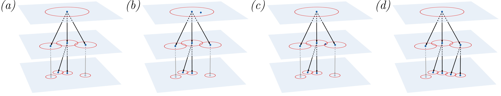

# Fully dynamic clustering and diversity maximization in doubling metrics

Code and data repository from the paper "Fully dynamic clustering and diversity maximization in doubling metrics", published in ACM TKDD. 

|  |
|:--| 
| A visualization of the insertion procedure for a cover tree $T$ over 4 points (associated to the leaves) and spanning 3 levels. _Panel (a)_: Visualization of the explicit representation of  before the insertion. At each level $\ell$, red circles of radius $2^\ell$ are shown around the points. Grayed-out nodes are present in the implicit representation, but not in the explicit one. _Panels (b)-(d)_: Steps of the insertion procedure. |

We present approximation algorithms for some variants of k-center clustering and diversity maximization in a fully dynamic setting, where the active pointset evolves through arbitrary insertions and deletions. All algorithms employ a coreset-based strategy and rely on the use of the cover tree data structure.

We obtain a 2+ε approximation algorithm for the k-center problem with state-of-the-art update times  in low dimensional metric spaces. We also obtain the first fully-dynamic 2+ε approximation algorithm for the k-center problem with outliers, as well as the first fully-dynamic algorithms for matroid center and diversity maximization. 
Finally, we provide an efficient implementation of the _cover tree_ data structure, as well as an extensive experimental evaluation of our algorithms. 

### Citing our work
> Paolo Pellizzoni, Andrea Pietracaprina, and Geppino Pucci. "Fully dynamic clustering and diversity maximization in doubling metrics". ACM Trans. Knowl. Discov. Data. 2025. [[PDF]](https://dl.acm.org/doi/10.1145/3727881)
